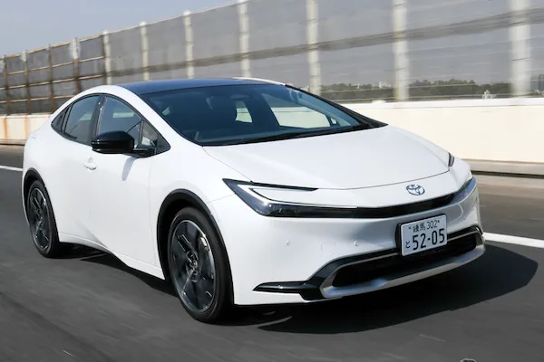

# JPN_Automotive_Trends
An investigation into the trends of the Japanese automotive industry

### Summary

As of 2024, ["Japanese automakers collectively hold a 30% share of the global auto market, including gasoline vehicles."](https://japannews.yomiuri.co.jp/business/economy/20240520-186976/) 

### Motivating Research Questions
1. How have the production and export trends of motor vehicles and motorcycles in Japan evolved from 1993 to 2024? Are there any noticeable patterns or significant changes during this period?
2. What is the correlation between Japan’s motor vehicle and motorcycle production/export data and its overall economic performance? How do these industries contribute to Japan’s GDP?
3. How have major global events (e.g., economic crises, pandemics, trade agreements) influenced Japan’s motor vehicle and motorcycle production and export trends?

### Question 1
- Make chart with Real GDP, Seasonally-adjusted employment rate, population
### Question 2
### Question 3
- See [Japan disaster history data](https://www.worlddata.info/asia/japan/volcanoes.php) (considered mapping these in ArcGIS)
- Compare disasters to economic and production/export data

### Original Files
Production - Motor vehicle 1993-2024.csv 
Production - Motor vehicle 1993-2024.csv 
Export - Motorcycle 1993-2024.csv 
Export - Motorcycle 1993-2024.csv 
Real Gross Domestic Product for Japan.csv 
Global price of Brent Crude ($perBarrel).csv 
Seasonally Adjusted Employment Rate.csv 

### Links to Datasets

[Production and Exports Motorcycle / Motor vehicles](https://jamaserv.jama.or.jp/newdb/eng/index.html) 
[Real GDP for Japan](https://fred.stlouisfed.org/series/JPNRGDPEXP#0) 
[Global price of Brent Crude ($ per barrel)](https://fred.stlouisfed.org/series/POILBREUSDM) 
[Seasonally Adjusted Employment Rate](https://fred.stlouisfed.org/series/LREM64TTJPM156S) 

